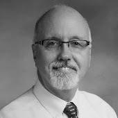

# Peter Beens

## Bio

Peter is a retired Computer Science, Computer Technology, Communications Technology, and ICT in Business teacher (1993-2007, 2009-2019) and department head. Peter was also an Education Officer (2007-2009) at the Ontario Ministry of Education where he was responsible for the writing, editing, and public rollout of the current Technological Education and Computer Studies curricula; was Senior Flight Test Technologist (1986-1992) at Eurocopter Canada (now Airbus Helicopters); and was a Flight Test Technician (1981-1985) at the Aerospace Engineering Test Establishment while serving in the Canadian Armed Forces.

Peter volunteers with the Association for Computer Studies Educators (ACSE, past-president), OTF Curriculum Forum steering committee (chair), Royal Canadian Legion Branch 138 (Treasurer & Secretary), Chapter 22 (Niagara) of ARM (Active Retired Members), and Niagara BMW Riders Association (Social Convenor). His past volunteer work also includes WordPress Niagara (on the conference committee) and Cyber-Seniors (Tech Mentor).

His interests are computing, programming, AI, photography, playing bass guitar, travelling in his old Sprinter van, and long-distance and adventure motorcycling.

## Links

- Blog: [https://www.beens.ca](https://www.beens.ca)
- Photography blog: [https://www.beens.ca/photo](https://www.beens.ca/photo)
- Mastodon: <a rel="me" href="https://mstdn.ca/@pbeens">https://mstdn.ca/@pbeens</a>
- X: [https://twitter.com/pbeens](https://twitter.com/pbeens)
- Facebook: [https://www.facebook.com/pbeens](https://www.facebook.com/pbeens)
- YouTube: [https://www.youtube.com/user/pbeens/videos](https://www.youtube.com/user/pbeens/videos)
- Email Lists: <https://www.beens.org/email-lists>
- GitHub: [https://github.com/pbeens](https://github.com/pbeens)
  - [Curriculum](https://github.com/pbeens/Curriculum)
  - [Presentations](https://github.com/pbeens/Presentations)
  - [All Repositories](https://github.com/pbeens?tab=repositories)
- LinkedIn: [https://www.linkedin.com/in/peter-beens](https://www.linkedin.com/in/peter-beens)

## Inactive Links

- Python blog: [http://www.beens.ca/python](http://www.beens.ca/python)
- Learning to Fly blog: [https://www.beens.ca/flying](https://www.beens.ca/flying) 
- Flickr: [https://www.flickr.com/photos/pbeens](https://www.flickr.com/photos/pbeens/) (See my [Photo Blog](https://www.beens.ca/photo) instead) 
- Programming challenges: [https://challenges.beens.org](https://challenges.beens.org)
- Teaching websites (no longer active): https://www.beens.org and http://www2.beens.org
- Solo EV blog: [https://www.beens.ca/solo](https://www.beens.ca/solo)

## URLs of This Page

- [https://peter.beens.ca](https://peter.beens.ca)
- [https://pbeens.github.io](https://pbeens.github.io)

## Contact Information

Please email me at peter@beens.ca.

      
<[Sites link](https://sites.google.com/view/peter-beens)>
